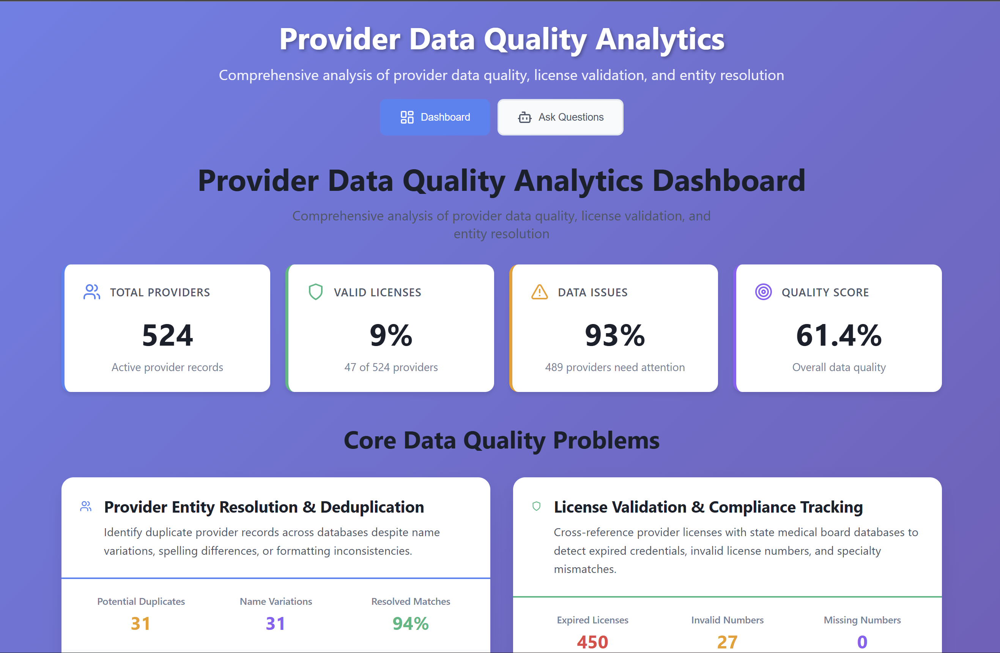
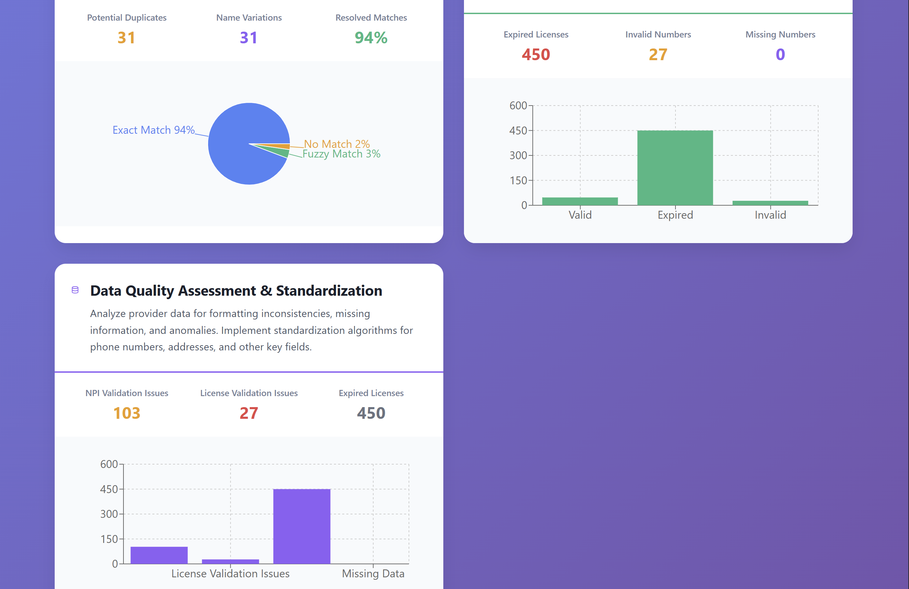
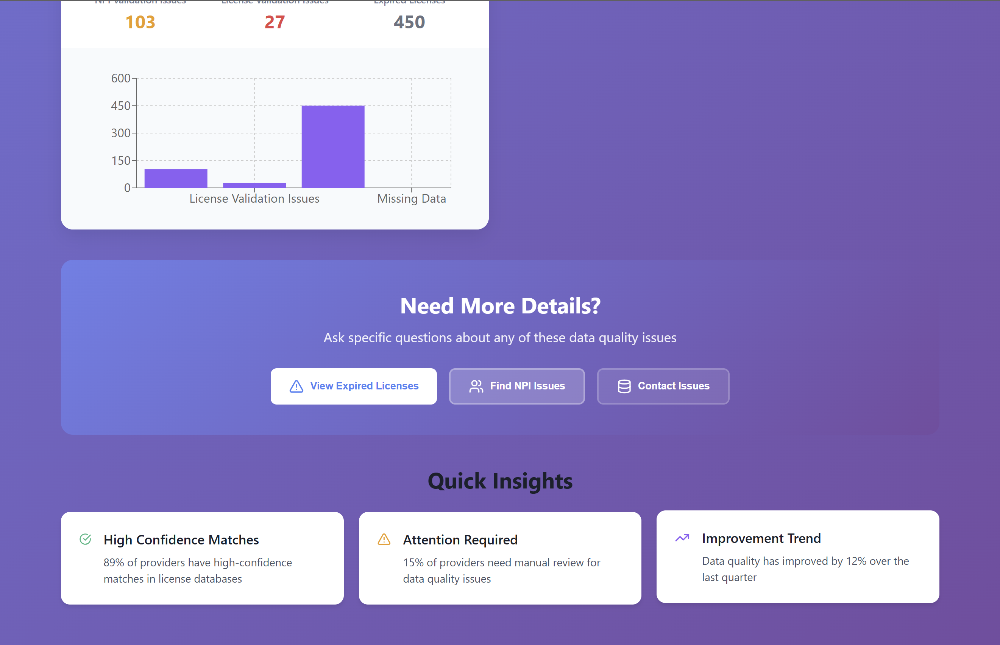
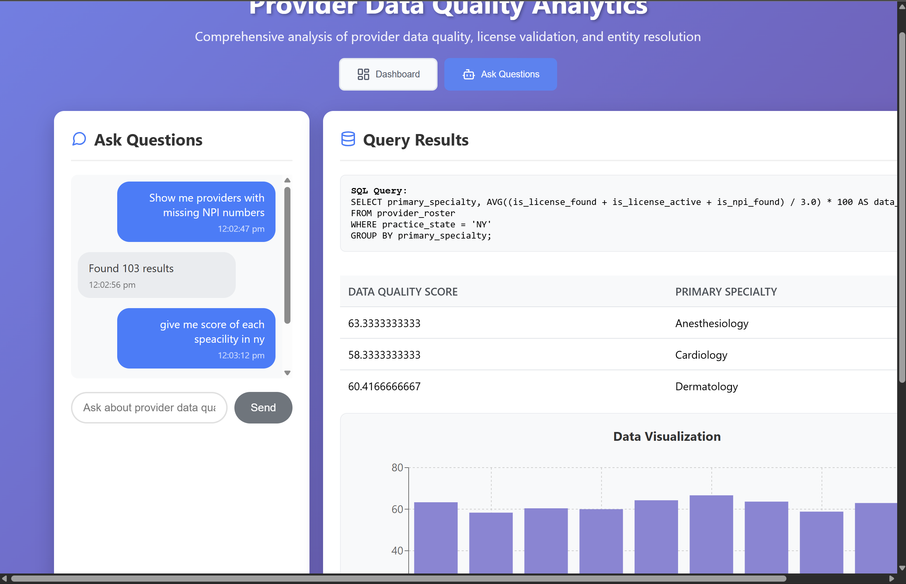
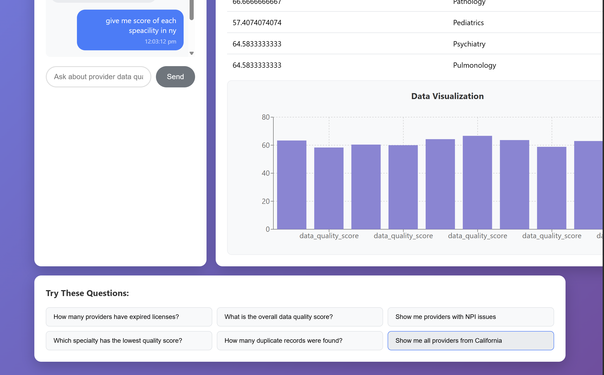

# Provider Data Quality Analytics Dashboard

A comprehensive web application that analyzes provider data quality, validates medical licenses, and performs entity resolution using AI-powered natural language queries. The system combines a React frontend with a Flask backend and uses Ollama for SQL generation.

## 🎯 Project Overview

This application addresses three core data quality problems:

1. **Provider Entity Resolution & Deduplication** - Identifies duplicate provider records across databases despite name variations, spelling differences, or formatting inconsistencies
2. **License Validation & Compliance Tracking** - Cross-references provider licenses with state medical board databases to detect expired credentials, invalid license numbers, and specialty mismatches  
3. **Data Quality Assessment & Standardization** - Analyzes provider data for formatting inconsistencies, missing information, and anomalies

### 📸 Screenshots

**Dashboard Screenshots:**
<table>
<tr>
<td></td>
<td></td>
</tr>
<tr>
<td colspan="2" style="text-align: center;"></td>
</tr>
</table>

## 🏗️ Architecture

```
┌─────────────────┐    ┌─────────────────┐    ┌─────────────────┐
│   React Frontend │    │  Flask Backend  │    │  Ollama LLM     │
│                 │    │                 │    │                 │
│ • Dashboard     │◄──►│ • API Endpoints │◄──►│ • SQL Generation│
│ • Chatbot       │    │ • Database      │    │ • Query Analysis│
│ • Visualizations│    │ • Data Processing│    │                 │
└─────────────────┘    └─────────────────┘    └─────────────────┘
```

## 📁 Project Structure

```
hi-labs-hackathon/
├── app.py                    # Flask backend server
├── database_setup.py         # Database initialization and data processing
├── query_generator.py        # AI-powered SQL query generation
├── data/                     # CSV data files
│   ├── provider_roster_with_errors.csv
│   ├── ny_medical_license_database.csv
│   ├── ca_medical_license_database.csv
│   └── mock_npi_registry.csv
├── frontend/                 # React frontend
│   ├── src/
│   │   ├── App.js           # Main application component
│   │   ├── components/
│   │   │   ├── Dashboard.js # Analytics dashboard
│   │   │   └── DataVisualization.js
│   │   └── App.css          # Styling
│   └── package.json
├── start_app.bat            # Windows launcher script
├── setup_qwen_model.bat     # Model setup script
└── README.md
```

## 🚀 Quick Start

### Prerequisites

- **Python 3.8+**
- **Node.js 14+** and npm
- **Ollama** installed and running
- **qwen2.5-coder:7b** model pulled in Ollama

### Installation

1. **Clone the repository**
   ```bash
   git clone <repository-url>
   cd hi-labs-hackathon
   ```

2. **Install Python dependencies**
   ```bash
   pip install -r requirements.txt
   ```

3. **Install Ollama and pull the model**
   ```bash
   # Install Ollama (follow instructions at https://ollama.ai)
   ollama pull qwen2.5-coder:7b
   ```

4. **Install frontend dependencies**
   ```bash
   cd frontend
   npm install
   cd ..
   ```

### Running the Application

⚠️ **IMPORTANT**: Always start the backend first, then the frontend!

#### Option 1: Using the launcher script (Windows)
```bash
# This will start both backend and frontend
start_app.bat
```

#### Option 2: Manual startup
```bash
# Terminal 1: Start Flask backend
python app.py

# Wait for backend to fully load (you'll see "Database schema loaded.")
# Terminal 2: Start React frontend  
cd frontend
npm start
```

The application will be available at:
- **Frontend**: http://localhost:3000
- **Backend API**: http://localhost:5001

## 📊 Features

### Dashboard View
- **Real-time Analytics**: Overview of provider data quality metrics
- **Core Problem Visualization**: Interactive charts for the three main data quality issues
- **Key Performance Indicators**: Total providers, valid licenses, data issues, quality score
- **Quick Actions**: Direct links to ask specific questions about data quality

### Chatbot Interface
- **Natural Language Queries**: Ask questions in plain English
- **AI-Powered SQL Generation**: Uses Ollama to convert questions to SQL
- **Real-time Results**: Instant query execution and result display
- **Data Visualization**: Automatic chart generation for query results

**Chatbot Screenshots:**
<table>
<tr>
<td></td>
<td></td>
</tr>
</table>

## 💬 Query Examples

### ✅ Good Queries (Recommended)
```
- "How many providers have expired licenses?"
- "Show me providers by specialty in California"
- "What is the overall data quality score?"
- "Which specialty has the most providers?"
- "Show me providers with missing NPI numbers"
- "How many providers are in each state?"
```

### ❌ Avoid Complex Queries
The model is optimized for small, focused queries. Avoid:
- Multi-table complex joins
- Nested subqueries
- Very long, complex questions
- Questions requiring multiple aggregations

##  Data Schema

The application dashboard is currently hardcoded for the following schema:

### Provider Roster Table
- `provider_id`, `npi`, `first_name`, `last_name`, `full_name`
- `primary_specialty`, `practice_state`, `license_number`, `license_state`
- `practice_phone`, `practice_address_line1`, `practice_city`
- `is_license_found`, `is_license_active`, `is_npi_found` (validation flags)

### License Databases
- **NY Medical License Database**: `provider_name`, `license_number`, `expiration_date`
- **CA Medical License Database**: `provider_name`, `license_number`, `expiration_date`
- **NPI Registry**: `provider_first_name`, `provider_last_name`, `npi`

## 🔧 Customization

### Adding New Datasets
To use with different datasets, ensure your data matches the exact schema above. The dashboard queries are hardcoded for this specific structure.

### Modifying Queries
Edit `frontend/src/components/Dashboard.js` to customize dashboard queries:
```javascript
const dashboardQueries = [
  {
    name: 'summary',
    sql: `SELECT COUNT(*) AS total_providers FROM provider_roster`
  }
  // Add more queries here
];
```

### Changing the AI Model
Update the model in `query_generator.py`:
```python
model='qwen2.5-coder:7b'  # Change to your preferred model
```

##  Troubleshooting

### Common Issues

1. **Frontend shows loading forever**
   - Ensure backend is fully loaded first
   - Check that Flask server is running on port 5001
   - Verify Ollama is running and model is pulled

2. **"Connection refused" errors**
   - Start backend before frontend
   - Check if port 5001 is available
   - Restart both services

3. **SQL generation fails**
   - Keep queries simple and focused
   - Avoid complex multi-table joins
   - Check Ollama model is loaded correctly

4. **Dashboard shows zeros**
   - Verify data files are in the `data/` directory
   - Check CSV column names match expected schema
   - Ensure database setup completes successfully

### Performance Tips

- **Query Speed**: Simple queries work best with the small model
- **Data Loading**: Initial database setup may take 1-2 minutes
- **Memory Usage**: Large datasets may require more RAM

## 📈 Data Processing Pipeline

1. **Data Loading**: CSV files are loaded and cleaned
2. **Fuzzy Matching**: Provider names are matched against license databases using fuzzy string matching (85% similarity threshold)
3. **Validation**: NPI and license validation flags are set
4. **Database Creation**: In-memory SQLite database is populated
5. **API Ready**: Backend serves queries via REST API

## 🔍 API Endpoints

- `GET /` - API status
- `POST /chat` - Natural language to SQL conversion
- `POST /execute_sql` - Direct SQL execution (for dashboard)

## 🛠️ Development

### Backend Development
```bash
# Run in debug mode
python app.py

# Test database setup
python -c "from database_setup import setup_database; setup_database()"
```

### Frontend Development
```bash
cd frontend
npm start
```

### Testing Queries
```bash
# Test dashboard queries
python test_dashboard.py

# Test specific SQL
curl -X POST http://localhost:5001/execute_sql \
  -H "Content-Type: application/json" \
  -d '{"sql": "SELECT COUNT(*) FROM provider_roster"}'
```

## 📝 License

This project is part of the HI Labs AI Quest hackathon.


1. Verify all prerequisites are installed
2. Ensure backend starts before frontend
3. Keep queries simple and focused

---

**Happy analyzing! 🎉**
